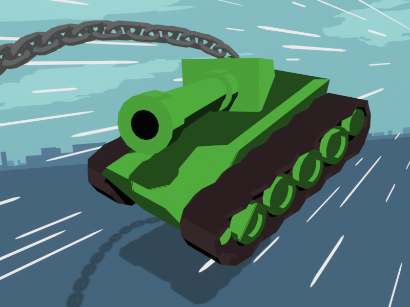

# TANKERS

Play it [on Itch](https://ncharlie.itch.io/tankers)!

A game built in two weeks for BOSS BASH JAM.

Built using zig + odin + Raylib (using [my template](https://github.com/charles-l/zig-odin-raylib-template)).
Pixel art done in Aseprite. Hero image rendered in Blender.
Music written and recorded during the jam.

# Build instructions

Download and install odin (make sure it's in the path).

To build for desktop (tested on Linux/Windows):

    $ zig build run
    $ zig build -Dtarget=x86_64-windows  # cross-compile to Windows from linux

To build for web:

    $ zig build -Dtarget=wasm32-wasi --sysroot ~/src/emsdk/upstream/emscripten/
    $ python -m http.server

Then navigate to `http://localhost:8000/game.html` in a web browser.

# Notes after releasing from 2023-07-07

- (As usual) I had more fun focusing on aesthetics than gameplay. I only had
  the boss level in progress for most of the jam and very little gameplay until
  the last two days. This isn't a good situation to be in, but I don't like
  making gameplay with rectangles and circles :|
- Started working on a brand new animation pipeline, then realized that was a bad idea and threw it out. Don't do that during a game jam, man. Cmon.
- For the pixel art, I just picked a [palette from lospec](https://lospec.com/palette-list) and got cracking. I redrew the boss a few times and really liked doing some of the particle effects.
- The music was pretty standard "orchestral-ish-into-boss-rock" that I've done before. Getting a snare loop I liked took some time.
- Odin worked well. I continue to plan to use it for gamedev (no other languages can quite compete with the convenience)
    - It's basically as nice as Python for game code and the type checking really helps.
    - Much safer/easier to debug than C.
    - Being able to statically allocate everything from the start is nice.
    - I hit a bunch of issues since the odin compiler just compiled to a `.o` file and
      zig linked it all together so odin didn't own the entrypoint. I fixed it
      part way through the jam when I realized the runtime needed to be initialized explicitly.
    - Hit a bug with an out of date odin compiler on Windows that would miscompile passing structs and segfault.
- Zig made the compilation story nice (especially on Windows which is always a mess).
- Code got more spaghetti-ish towards the end as usual. I need to figure out a consistent way of
  dealing with one-off events and rate limiting in the future. State machines are still great.
- Hit some issues when compiling for web.
    - Had to mess around to figure out the correct combination of flags in `build.zig` to actually get it running.
    - Then it wasn't picking up inputs because order of input/rendering matters on web (rendering has to happen after, but it doesn't matter on desktop)
    - Then a bunch of stuff was broken because the default allocator on Odin + web doesn't allocate
      [because memory allocation on WASM is weird](https://github.com/odin-lang/Odin/issues/1947#issuecomment-1214224591).
      I just removed all dynamic allocations from the game.
    - Then I was relying on `GL_REPEAT` wrapping for parallax cityscape and that
      [doesn't work on webgl](https://github.com/raysan5/raylib/blob/master/src/rlgl.h#L3041-L3046).
      So I rewrote it to render the texture twice and auto wrap back around.
